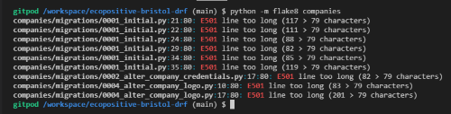

# ecoPositive Bristol (Django REST API)

This is the backend service used by the [ecoPositive Bristol](https://ecopositive-react-pp5-0012331e7023.herokuapp.com/) application.

The goal of this API is to provide the backend data framework which communicates with the front end REACT User Interface enabling users to create, read, update and delete data associated with the application.

[ecoPositive Bristol](https://tastesensation-pp4-54d01fbc1628.herokuapp.com/) is a one stop directory championing Bristol’s eco-conscious and socially responsible businesses.

Business owners are invited to list their company or business and highlight their eco-positive credentials from a list of 50 pre-determined options listed under group headings.

All users are able to view the directory and see the company details so they can find an ecoPositive business whether they sign up or not. User are invited to sign up to endorse the companies that they support and comment on listed businesses so that other visitors to the site can see which businesses are popular.

## Planning

### Agile Methodology

***Trello Board***

- View the live [Trello ecoPositive Bristol Board](https://trello.com/b/HLP5BPb6/ecopositive-bristol)
- I first created a Trello Board As a starting point for gathering information and mapping out the general idea for ecoBristol.
- This includes the following:
  - Concept list with a variety of items some of which became EPICS and User Stories later on
  - CRUD functionality plans to ensure that this aspect of the assessment criteria is met
  - Potential Issues to consider when planning out the project details
  - Green Businesses - a list of companies and links to companies that would be good examples to include in the test site.
  - Green Credentials - a brainstorm of various 'credentials' that a company might wish to apply to their business as evidence of their ecoPositive practices / products.
  - Resources and credits - a list of tutorials, links, Stack Overflow discussions, Django documentation and many others that I used along the way to help with building the project and resolving issues.

***Kanban Board***

- View the live [ecoPositive Bristol Project Kanban Board](https://github.com/users/sophie-thomson/projects/4/)
- Following the principles outlined in the Code Institute Agile Working units, I created a GitHub Kanban Board and using Project Issues, Milestones and Labels I mapped out the ecoPositive Bristol project into:
   - EPICS (Overarching blocks of work broken down into USER STORY Issues)
   - To Do (USER STORY issues with acceptance criteria and tasks)
   - In Progress (USER STORY Issues in progress during each Milestone or 'Sprint')
   - Completed (USER STORY Issues that have been completed)
   - BUGS (BUG issues that define a particular issue encountered during the project and how it was resolved)

***MoSCoW***

- Using MoSCoW Prioritisation, each USER STORY and EPIC issue in the kanban board was assigned a label:
   - **Must Have** - High priority Epics, User Stories and Tasks that MUST be included and working in the finished project in order to have a working project and address the Assessment Criteria.
   - **Should Have** - Epics, User Stories and Tasks that SHOULD be included in the project, but that won't cause the project to break and are not required in order to address the assessment criteria.
   - **Could Have** - Epics, User Stories and Tasks that COULD be included in the project, but that are more of a nice to have addition and should not be prioritised over the Must Have or Should Have issues.
   - **Won't Have** - Epics, User Stories and Tasks that WON'T be included in the project. These are issues that would have been nice to include given more time, but do not affect the usability of the project and are not required to address the assessment criteria.
     - EPIC and USER STORY issues that this project Won't Have at the point of submission are:
        - [#30](https://github.com/sophie-thomson/ecopositive-bristol-drf/issues/30#issue-2718771703)
        - [#5](https://github.com/sophie-thomson/ecopositive-bristol-drf/issues/5#issue-2718751469)
        - [#44](https://github.com/sophie-thomson/ecopositive-bristol-drf/issues/44#issue-2718781463)
        - [#43](https://github.com/sophie-thomson/ecopositive-bristol-drf/issues/43#issue-2718780838)

***Sprints and Story Points***

- Having broken down each EPIC into USER STORY issues and identified the Must Have priorities, I then split the time I had available until the submission date down into 4-day development 'Sprints' and assigned a date range to each of the Milestones. 
- Estimating that I could work an average of 6hrs per day on my project, I then broke each 'day' into two 'Story Point' blocks of 1-3hrs per block (8 Story Points per Sprint).
- Given my previous experience and my level of understanding and programming skills, I made an estimate of how many Story Point blocks it would take me to complete the tasks for each User Story.
- Arranging each User Story Issue in logical progressional order, I assigned each User Story a certain number of Story Points and a particular Milestone Sprint within which I would aim to complete that set of tasks.
- This approach kept me on track to complete all of the Must Have labelled User Stories required to complete a working project and address the assessment criteria for PP5.

## Data

### Models

- The next step was to plan and devise an ERD for each of my database models and a schema to map out and understand the relationships between them. I created an ERD and model schema for the project based on all of the elements that I would like to include.

- I created an ERD for the following models:
  - User Model (Automatically created in Django framework)
  - Profile Model
  - Company Model
  - Comment Model
  - Credential Model
  - Endorsement Model

### API End Points

To enable data to be created, read, updated and deleted specific API endpoints were created for each of the models. These were included as url paths in each app folder and provided a specific digital location where user requests for information are sent and retrieved from.

**Profiles**

A user profile is automatically created on signup via the OneToOne field with the default user model in Django. In order to access this data, an endpoint was created in the profiles app urls.

Endpoint - */profiles/*

  - Methods:
      - POST - Used to create a profile
      - GET - Used to get a list of profiles

  - Permissions:
      - None, as profile creation is handled by django signals 

Endpoint - */profiles/<int:pk>/*

  - Methods:
      - GET - Get a single profile
      - PUT - Used to update a single profile
      - DELETE - Used to delete a profile
    
  - Permissions:
      - IsOwnerOrReadOnly - to ensure that only the owner is authorized to update or delete a profile.

**Companies**

Endpoint - */companies/*

  - Methods:
      - POST - Used to create a company
      - GET - Used to get a list of other companies

  - Permissions:
      - IsAuthenticatedOrReadOnly - Ensures that only logged in users can create (post) a new company, but any user can read (get) company data.

Endpoint - */companies/<int:pk>/*

  - Methods:
      - GET - Get a single company
      - PUT - Used to update a single company
      - DELETE - Used to delete a company
    
  - Permissions:
      - IsOwnerOrAdminOrReadOnly - to ensure that only the company owner or a staff admin (is_staff = true) is authorized to update or delete a company. This bespoke permission was created to enable the admin to 'authorise' a company in the admin page of the app without being a superuser.

**Comments**

Endpoint - */comments/*

  - Methods:
      - POST - Used to create a comment
      - GET - Used to get a list of comments

  - Permissions:
      - IsAuthenticatedOrReadOnly - Ensures that only logged in users can create (post) a new comment, but any user can read (get) a list of comments.

Endpoint - */comments/<int:pk>/*

  - Methods:
      - GET - Get a single comment
      - PUT - Used to update a single comment
      - DELETE - Used to delete a comment
    
  - Permissions:
      - IsAuthenticatedOrReadOnly - Ensures that only logged in users can report another person's comment. Conditional rendering in the UI is used to ensure that only the comment owner or an admin has access to the forms and functionality to update or delete a comment.

**Credentials**

Endpoint - */credentials/*

  - Methods:
      - POST - Used to create a credential
      - GET - Used to get a list of credentials

  - Permissions:
      - IsAuthenticatedOrReadOnly - Ensures that only logged in users can create (post) a new credential, but any user can read (get) a list of credentials.

Endpoint - *credentials/<int:pk>/*

  - Methods:
      - GET - Get a single credential
      - PUT - Used to update a single credential
      - DELETE - Used to delete a credential

  - Permissions:
      - IsOwnerOrReadOnly - to ensure that only the owner is authorized to update or delete a profile.

**Endorsements**

Endpoint - */endorsements/*

  - Methods:
      - POST - Used to create an endorsement
      - GET - Used to get a list of endorsements

  - Permissions:
      - IsAuthenticatedOrReadOnly - Ensures that only logged in users can create (post) a new credential, but any user can read (get) a list of endorsements.

Endpoint - *endorsements/<int:pk>/*

  - Methods:
      - GET - Get a single endorsement
      - PUT - Not used in this model as users are not able to 'update' an endorsement - they can only create or remove it for a particular company instance.
      - DELETE - Used to delete (remove) an endorsement

  - Permissions:
      - IsOwnerOrReadOnly - to ensure that only the owner is authorized to remove (delete) their endorsement.

### Eco-Credentials

Having built the framework for holding the required data sets, I researched the various ways in which a company or business might be able to validate their ecoPsositive actiions or products. A list of 50 potential eco-credentials were drafted in an excel spreadsheet and grouped unmder four main headings:
  - Eco-Conscious Approach
  - Membership / Accreditation
  - Socially Responsible
  - Sustainable Methods / Materials

## Technologies

- Django
    - Main framework used for application creation
- Django REST Framework
    - Framework used for creating API
- Heroku
    - Used for hosting the deployed application
- GitPod
    - Used for building and version control
- Github
    - Repository for storing code base and docs

### PostgreSQL Database

In order to store all the data a PostgreSQL database was created via the Code Institute database creator.

The database was connected to the api and to the front end UI via the Heroku Config Var settings. To ensure that no sensitive data was pushed to the GitHub repository, the database url was stored in an env.py files which would not be included in the deployment build.

### Cloudinary

Cloudinary was used to store all images submitted through the site such as company logos and profile images.

Cloudinary is connected to the api and to the front end UI via the Heroku Config Var settings. To ensure that no sensitive data was pushed to the GitHub repository, the Cloudinary url was stored in an env.py files which would not be included in the deployment build.

### Secret Key

A new secret key was created using a [Django Secret Key Generator](https://djecrety.ir/) and this was stored in the env.py file so that it is not available publicly in GitHub or in the deployed build. 

## Python Packages

 Details of packages 

* dj-database-url==0.5.0
    * Used to parse the DATABASE_URL connection settings
* dj-rest-auth==2.1.9
    * Used with auth system
* Django==4.2
    * Main framework used to start the project
* django-allauth==0.54.0
    * Used for authentication
* django-cors-headers==4.6.0
    * Used for Cross-Origin Resource Sharing (CORS) headers to responses
* django-filter==24.3
    * Used to filter API results in serializers
* django-resized==1.0.3
    * Used to set image validation and formatting within the model field
* djangorestframework==3.15.2
    * Framework used to build the API endpoints
* djangorestframework-simplejwt==5.3.1
    * Used with djange rest framework to create access tokens for authentication
* gunicorn==23.0.0
    * Used for deployment of WSGI applications
* Pillow==8.2.0
    * Imaging Libray - used for image uploading
* psycopg2==2.9.10
    * PostgreSQL database adapter to allow deployed application to perform crud on the postgresql db
* PyJWT==2.10.1
    * For creating the Python Json Web Tokens for authentication
* cloudinary==1.41.0
    * For storing static images
* django-cloudinary-storage==0.3.0
    * For managing cloudinary images within django framework

Installed as package dependcies with above installations:
* asgiref==3.8.1
* oauthlib==3.2.2
* phonenumberslite==8.13.52
* python3-openid==3.2.0
* requests-oauthlib==2.0.0
* sqlparse==0.5.2
* whitenoise==6.8.2

## Testing

### Automated Testing

Each resource in the API has been tested using the REST built-in APITestCase functionality. Tests are written in a tests.py file within each app directory. 

Each test is manually checked by forcing a controlled fail by using an incorrect status code and ensuring that this is the only reason the test fails.

The status code is then updated and the test run again to ensure it passes with the expected status code.

***Companies***

  - **CompanyListViewTests**
    - test_can_list_companies
    - test_logged_in_user_can_create_company
    - test_user_not_logged_in_cant_create_company

  - **CompanyDetailViewTests**
    - test_can_retrieve_company_using_valid_id
    - test_cant_retrieve_company_using_invalid_id
    - test_user_can_update_own_company
    - test_user_cant_update_another_users_company

***Comments***

  - **CommentListViewTests**
    - test_can_list_all_comments
    - test_logged_in_user_can_create_comment
    - test_user_not_logged_in_cant_create_comment

  - **CommentDetailViewTests**
    - test_can_retrieve_comment_using_valid_id
    - test_cant_retrieve_comment_using_invalid_id
    - test_user_can_update_own_comment
    - test_logged_in_user_can_report_another_users_comment
    - test_user_not_logged_in_cant_report_another_users_comment

***Credentials***

  - **CredentialListViewTests**
    - test_can_list_all_credentials
    - test_logged_in_user_can_create_credential
    - test_cant_create_credential_if_not_logged_in

  - **CredentialDetailViewTests**
    - test_can_retrieve_credential_using_valid_id
    - test_cant_retrieve_credential_using_invalid_id
    - test_owner_can_update_own_credential
    - test_cant_update_credential_logged_in_but_not_owner

***Profiles***

  - **ProfileDetailViewTests**
    - test_can_retrieve_profile_using_valid_id
    - test_cant_retrieve_profile_using_invalid_id
    - test_user_can_update_own_profile
    - test_user_cant_update_another_users_profile

### Additional testing from front end UI

Each of the above scenarios will also be tested along with core testing of all data manipulation and retrieval via user interactions and form data in the front end REACT UI. 

Please refer to the testing section of the [ecoPositive Bristol (REACT UI) README](https://github.com/sophie-thomson/ecopositive-bristol-react-ui) for further details.

## Python Linter Validation

All python code featured in the drf project was passed through flake8 validation.

All issues were resolved with the exception of lines too long in migration files (these are auto generated so I did not fix these).

The drf-api results also include 2 errors for the imports of 're and 'env' in the settings.py file which are apparently not used.
As these were also part of the walkthrough content and the env is triggered by the presence of an env.py file I have left both warnings in place.
Neither of these warnings prevents the app from running successfully.

## Bugs

All major bugs are recorded as an issue in the [ecoPositive Bristol drf-api kanban board](https://github.com/users/sophie-thomson/projects/4/).

These are all resolved at the point of deployment and full details of the solution are included in each bug issue.

- [#58] Validation error to prevent user endorsing own company not working.
    - Solved with reference to [REST documentation on serializers](https://www.django-rest-framework.org/api-guide/serializers/#saving-instances).
- [#57] Serializer to retrieve endorsing users for a company not working.
    - Solved with support and guidance from CI Tutor Support to write the correct serializer code using __ model linking
- [#59] Heroku Build Throwing Error and Aborted.
    - Solved with reference to Heroku guidance on [Specifying a Python Version](https://devcenter.heroku.com/articles/python-runtimes)
- [#61] Endorsement_id undefined and endorsement removal not working.
    - Solved by reviewing all model fields and serializers and adding missing field to be access from the UI.
- [#62] is_staff field not being inherited from User model.
    - Initially solved with a workaround field being added to Profile model. Upon reinvestigation later on, I was able to update my ProfileSerializer to retrieve the required data.

## Deployment

### Gitpod Version Control

This site was created using the Gitpod cloud development environment before being pushed through to a dedicated repository on Github.

The following commands were used througout development to push the code through to the Github repo:

- **git add .** - This command was used to add any tracked files to the staging area.
- **git commit -m "Commit message."** - This command was used to create a snapshot of the staged area with a short description.
- **git push** - This command was used to push the committed changes from the current branch to the remote repository on Github.

### Deployment

The finished program was initially hosted within a repository on Github, and then this Github repository was connected with Heroku, the site through which the program is deployed.

***How to Deploy to Heroku***

The steps to deploy to Heroku are as follows:

- Ensure that all changed to the models have been migrated by typing the following command into the terminal: python3 manage.py makemigrations
    - If there are migrations made, type the following command into the terminal: python3 manage.py migrate
- Ensure that you have a file in your program file directory called: requirements.txt 
- Ensure that all imported libraries that are used in your program are listed in the requirements.txt file.
    - To add any new libraries, type the following command into the terminal: pip3 freeze > requirements.txt
- Collect all static files for your project by typing the following command into the terminal: python3 manage.py collectstatic
    - Type 'yes' if you have already collected static files before. This will overwrite previous files.
- Ensure you have installed gunicorn and that you have a Procfile file (has no file extension) which includes a single line of code: web: gunicorn tastesensation_project.wsgi
- Ensure that the DEBUG setting in settings.py is set to 'False'.
- Use **git add .** then **git commit -m "Commit message."** and then **git push** to push all latest changes into the relevant repository on Github.
- Go to the [Heroku Website](https://dashboard.heroku.com/) and log in by clicking on the link in the top right corner of the screen.
    - Sign up for a new Heroku account if needed. 
    - Please note you will need to add a payment card before Heroku will allow you to deploy any project. 
    - To do this you will need to click on your account profile in the top right corner and click on Account Settings, then select the Billing tab and follow the instructions to add a credit card. 
- Once logged in, click on the **'New'** drop down menu at the top of your dashboard and select **'Create new app'**
- Choose a name for your app ideally using the same conventions as your project name in your Github repository
- Select the region that you are located in from the options shown
- Ignore the Add to pipeline... button and click on **'Create app'**
- Select the **'Settings'** tab at the top of the screen and scroll to the Config Vars section
- Click on **'Reveal Config Vars'** and if you have an env.py file with confidential information add these as Config Variables here. This project includes:
    - ALLOWED_HOST: {deployed url}
    - CLIENT_ORIGIN: {deployed front end url}
    - CLIENT_ORIGIN_DEV: {dev site url}
    - CLOUDINARY_URL: {confidential value}
    - DATABASE_URL: {confidential value}
    - SECRET_KEY: {confidential value}
- Once all Config Vars are in place scroll back to the top of the page and click on the 'Deploy' tab.
- In the Deployment Method section, select Github and confirm that you want to connect to Github.
- In the 'Search for a repository to connect to' type in the name of the repository that you want to deploy and click **'Search'**.
- Click on the **'Connect'** button next to the correct Github repository in the search results
- Scroll down to select whether you would like to deploy automatically (Heroku will build a new app every time you push new updates through to the Github repository), or whether you would like to deploy manually at less regular intervals when you wish to check or test something.
- Click on **'Deploy Branch'** (ensure that the branch selected is 'main') to deploy manually when you want to.
- Heroku will build your app and will then display a 'View' button at the bottom of the screen.
- Click **'View'** to see your deployed project!

## Credits & References

## References
- The CI Django REST Framework walkthrough project for 'Moments' was used as a reference when building the inital project in django and the basis for the company, profile and comment models and views.
- [Django REST framework documentation](https://www.django-rest-framework.org/api-guide/testing/#api-test-cases) - Was used to elp devise the tests for the comments resource in REST api.
- Medium article [How to write test cases for Django Rest Framework Applications](https://rajansahu713.medium.com/mastering-the-art-of-django-test-cases-fa7b0322c9fb) was used as further reference for writing API Test cases.
- Stack Overflow [Django: Safely Remove Old Migrations?](https://stackoverflow.com/questions/58000680/django-safely-remove-old-migrations) was used to help with rolling back migrations when making changes to models
  - [Django REST framework documentation](https://www.django-rest-framework.org/api-guide/serializers/#saving-instances) to help with Serializers for use of def create(self, validated_data) in endorsements
- CI Tutor Support helped to resolve BUG #57 Serializer to retrieve endorsing users for a company not working.

   