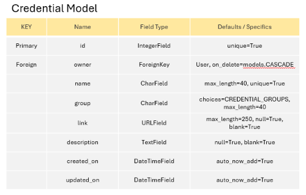

# ecoPositive Bristol (Django REST API)

This is the backend service used by the [ecoPositive Bristol](https://ecopositive-react-pp5-0012331e7023.herokuapp.com/) application.

The goal of this API is to provide the backend data framework which communicates with the front end REACT User Interface enabling users to create, read, update and delete data associated with the application.

[ecoPositive Bristol](https://tastesensation-pp4-54d01fbc1628.herokuapp.com/) is a one stop directory championing Bristol’s eco-conscious and socially responsible businesses.

Business owners are invited to list their company or business and highlight their eco-positive credentials from a list of 50 pre-determined options listed under group headings.

All users are able to view the directory and see the company details so they can find an ecoPositive business whether they sign up or not. User are invited to sign up to endorse the companies that they support and comment on listed businesses so that other visitors to the site can see which businesses are popular.

## Planning

### Agile Methodology

***Trello Board***

- View the live [Trello ecoPositive Bristol Board](https://trello.com/b/HLP5BPb6/ecopositive-bristol)
- I first created a Trello Board As a starting point for gathering information and mapping out the general idea for ecoBristol.
- This includes the following:
  - Concept list with a variety of items some of which became EPICS and User Stories later on
  - CRUD functionality plans to ensure that this aspect of the assessment criteria is met
  - Potential Issues to consider when planning out the project details
  - Green Businesses - a list of companies and links to companies that would be good examples to include in the test site.
  - Green Credentials - a brainstorm of various 'credentials' that a company might wish to apply to their business as evidence of their ecoPositive practices / products.
  - Resources and credits - a list of tutorials, links, Stack Overflow discussions, Django documentation and many others that I used along the way to help with building the project and resolving issues.

***Kanban Board***

- View the live [ecoPositive Bristol Project Kanban Board](https://github.com/users/sophie-thomson/projects/4/)
- Following the principles outlined in the Code Institute Agile Working units, I created a GitHub Kanban Board and using Project Issues, Milestones and Labels I mapped out the ecoPositive Bristol project into:
   - EPICS (Overarching blocks of work broken down into USER STORY Issues)
   - To Do (USER STORY issues with acceptance criteria and tasks)
   - In Progress (USER STORY Issues in progress during each Milestone or 'Sprint')
   - Completed (USER STORY Issues that have been completed)
   - BUGS (BUG issues that define a particular issue encountered during the project and how it was resolved)

***MoSCoW***

- Using MoSCoW Prioritisation, each USER STORY and EPIC issue in the kanban board was assigned a label:
   - **Must Have** - High priority Epics, User Stories and Tasks that MUST be included and working in the finished project in order to have a working project and address the Assessment Criteria.
   - **Should Have** - Epics, User Stories and Tasks that SHOULD be included in the project, but that won't cause the project to break and are not required in order to address the assessment criteria.
   - **Could Have** - Epics, User Stories and Tasks that COULD be included in the project, but that are more of a nice to have addition and should not be prioritised over the Must Have or Should Have issues.
   - **Won't Have** - Epics, User Stories and Tasks that WON'T be included in the project. These are issues that would have been nice to include given more time, but do not affect the usability of the project and are not required to address the assessment criteria.
     - EPIC and USER STORY issues that this project Won't Have at the point of submission are:
        - [#30](https://github.com/sophie-thomson/ecopositive-bristol-drf/issues/30#issue-2718771703)
        - [#5](https://github.com/sophie-thomson/ecopositive-bristol-drf/issues/5#issue-2718751469)
        - [#44](https://github.com/sophie-thomson/ecopositive-bristol-drf/issues/44#issue-2718781463)
        - [#43](https://github.com/sophie-thomson/ecopositive-bristol-drf/issues/43#issue-2718780838)

***Sprints and Story Points***

- Having broken down each EPIC into USER STORY issues and identified the Must Have priorities, I then split the time I had available until the submission date down into 4-day development 'Sprints' and assigned a date range to each of the Milestones. 
- Estimating that I could work an average of 6hrs per day on my project, I then broke each 'day' into two 'Story Point' blocks of 1-3hrs per block (8 Story Points per Sprint).
- Given my previous experience and my level of understanding and programming skills, I made an estimate of how many Story Point blocks it would take me to complete the tasks for each User Story.
- Arranging each User Story Issue in logical progressional order, I assigned each User Story a certain number of Story Points and a particular Milestone Sprint within which I would aim to complete that set of tasks.
- This approach kept me on track to complete all of the Must Have labelled User Stories required to complete a working project and address the assessment criteria for PP5.

## Data

***Models***

- The next step was to plan and devise an ERD for each of my database models and a schema to map out and understand the relationships between them. I created an ERD and model schema for the project based on all of the elements that I would like to include.

- I created an ERD for the following models:
  - User Model (Automatically created in Django framework)
  - Profile Model
  - Company Model
  - Comment Model
  - Credential Model
  - Endorsement Model

*** API End Points ***

***Credentials***

- 

## Testing

### Automated Testing

Each resource in the API has been tested using the REST built-in APITestCase functionality. Tests are written in a tests.py file within each app directory. 

Each test is manually checked by forcing a controlled fail by using an incorrect status code and ensuring that this is the only reason the test fails. The status code is then updated and the test run again to ensure it passes with the expected status code.  

***Companies***

- **CompanyListViewTests**
  - test_can_list_companies
  - test_logged_in_user_can_create_company
  - test_user_not_logged_in_cant_create_company

- **CompanyDetailViewTests**
  - test_can_retrieve_company_using_valid_id
  - test_cant_retrieve_company_using_invalid_id
  - test_user_can_update_own_company
  - test_user_cant_update_another_users_company

***Comments***

- **CommentListViewTests**
  - test_can_list_all_comments
  - test_logged_in_user_can_create_comment
  - test_user_not_logged_in_cant_create_comment

- **CommentDetailViewTests**
  - test_can_retrieve_comment_using_valid_id
  - test_cant_retrieve_comment_using_invalid_id
  - test_user_can_update_own_comment
  - test_user_can_report_another_users_comment
  - test_user_not_logged_in_cant_report_another_users_comment

***Credentials***

- **CredentialListViewTests**
  - test_can_list_all_credentials
  - test_logged_in_user_can_create_credential
  - test_cant_create_credential_if_not_logged_in

- **CredentialDetailViewTests**
  - test_can_retrieve_credential_using_valid_id
  - test_cant_retrieve_credential_using_invalid_id
  - test_owner_can_update_own_credential
  - test_cant_update_credential_logged_in_but_not_owner